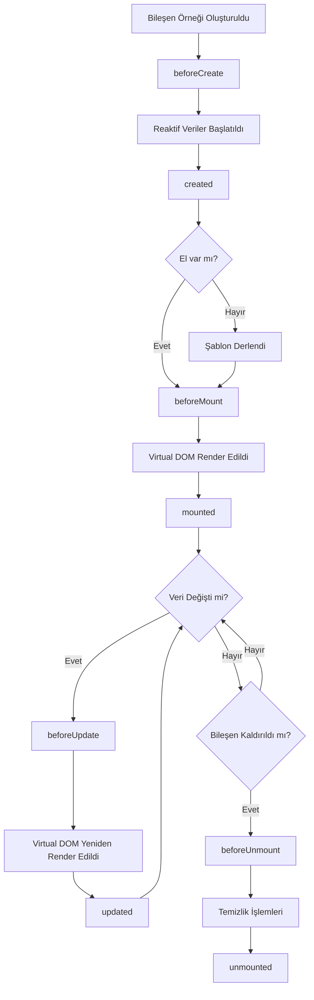
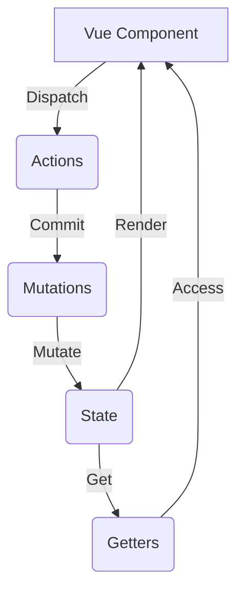

# Vue.js Notları

## 1. Vue.js Temel Kavramlar

### a) Template

- Vue bileşenlerinin HTML yapısını tanımlar.
- Çift süslü parantez `{{ }}` içinde JavaScript ifadeleri kullanılabilir.

Örnek:

```html
<template>
  <div>
    <h1>{{ title }}</h1>
    <p>{{ getMessage() }}</p>
  </div>
</template>
```

### b) Data

- Bileşenin durumunu tutan reaktif veri nesnesidir.
- Değiştiğinde otomatik olarak UI'ı günceller.
- Vue 3'te data bir fonksiyon olarak tanımlanır.

Örnek:

```javascript
export default {
  data() {
    return {
      title: "Merhaba Vue!",
      count: 0,
    };
  },
};
```

### c) Methods

- Bileşen içinde kullanılan fonksiyonlardır.
- Template içinde çağrılabilir veya olay işleyicileri olarak kullanılabilir.

Örnek:

```javascript
export default {
  methods: {
    incrementCount() {
      this.count++;
    },
    getMessage() {
      return `Sayaç: ${this.count}`;
    },
  },
};
```

### d) Computed Properties vs Methods

Computed properties ve methods arasındaki fark:

- Computed properties sonuçları önbelleğe alır ve bağımlı oldukları reaktif veriler değişmediği sürece yeniden hesaplanmazlar.
- Methods her çağrıldığında yeniden çalışır.

Örnek:

```javascript
export default {
  data() {
    return {
      message: "Hello",
    };
  },
  computed: {
    reversedMessage() {
      return this.message.split("").reverse().join("");
    },
  },
  methods: {
    reverseMessage() {
      return this.message.split("").reverse().join("");
    },
  },
};
```

### e) v-if ve v-show

- Koşullu render etme direktifleridir.
- `v-if`: Koşul doğruysa elementi DOM'a ekler, yanlışsa tamamen kaldırır.
- `v-show`: Koşula bağlı olarak elementin display özelliğini değiştirir.

Örnek:

```html
<p v-if="count > 5">Count 5'ten büyük</p>
<p v-show="isVisible">Bu metin görünür veya gizli olabilir</p>
```

Performans farkı:

- `v-if` elementi tamamen kaldırır veya ekler, bu nedenle ilk render maliyeti yüksektir ama sonraki değişiklikler daha az maliyetlidir.
- `v-show` elementi her zaman render eder ve sadece CSS `display` özelliğini değiştirir, bu nedenle ilk render maliyeti düşüktür ama sık değişen elementler için daha maliyetli olabilir.

### f) v-for

- Liste veya objeleri render etmek için kullanılır.
- Her öğe için bir template oluşturur.

Örnek:

```html
<ul>
  <li v-for="(item, index) in items" :key="index">{{ item.name }}</li>
</ul>
```

Key Attribute:

```html
<li v-for="item in items" :key="item.id">{{ item.name }}</li>
```

`key` özelliği, Vue'nun her öğeyi benzersiz bir şekilde tanımlamasını sağlar. Bu, liste öğelerinin yeniden sıralanması veya filtrelenmesi durumunda performansı artırır ve beklenmeyen davranışları önler.

### g) v-bind

- HTML özelliklerini dinamik olarak bağlar.
- Kısaltması `:` şeklindedir.

Örnek:

```html

<div :class="{ active: isActive }"></div>
```

### h) Event Handling

- `v-on` direktifi veya `@` kısayolu ile olayları dinler.

Örnek:

```html
<button v-on:click="incrementCount">Artır</button>
<input @input="handleInput" />
```

Event Modifiers:

```html
<!-- Tıklama olayının yayılmasını engeller -->
<a @click.stop="doThis"></a>

<!-- Form gönderimini engeller -->
<form @submit.prevent="onSubmit"></form>

<!-- Tuş olayları: enter tuşuna basıldığında tetiklenir -->
<input @keyup.enter="submit" />
```

## 2. Vue CLI

### a) Proje Oluşturma

- Vue CLI, Vue.js projeleri oluşturmak için kullanılan bir komut satırı aracıdır.
- Proje oluşturma komutu: `vue create proje-adi`

### b) Proje Yapısı

- `src/`: Kaynak kodların bulunduğu ana dizin
- `components/`: Vue bileşenlerinin bulunduğu dizin
- `views/`: Sayfa bileşenlerinin bulunduğu dizin
- `App.vue`: Ana uygulama bileşeni
- `main.js`: Uygulamanın giriş noktası

## 3. Bileşenler (Components)

### a) Bileşen Oluşturma

- `.vue` uzantılı dosyalar içinde tanımlanır.
- Template, script ve style bölümlerinden oluşur.

Örnek:

```vue
<template>
  <div class="example-component">
    <h2>{{ title }}</h2>
    <slot></slot>
  </div>
</template>

<script>
export default {
  name: "ExampleComponent",
  data() {
    return {
      title: "Örnek Bileşen",
    };
  },
};
</script>

<style scoped>
.example-component {
  border: 1px solid #ccc;
  padding: 10px;
}
</style>
```

### b) Bileşen Kullanımı

- Diğer bileşenlerde import edilip kullanılabilir.

Örnek:

```vue
<template>
  <div>
    <ExampleComponent>
      <p>Bu içerik slot'a yerleştirilecek</p>
    </ExampleComponent>
  </div>
</template>

<script>
import ExampleComponent from "./ExampleComponent.vue";

export default {
  components: {
    ExampleComponent,
  },
};
</script>
```

### c) Props

- Üst bileşenden alt bileşene veri aktarımı için kullanılır.

Örnek:

```vue
<!-- Üst Bileşen -->
<ChildComponent :message="parentMessage" />

<!-- Alt Bileşen -->
<script>
export default {
  props: ['message']
  // veya
  props: {
    message: {
      type: String,
      required: true,
      default: 'Varsayılan mesaj'
    }
  }
}
</script>
```

### d) Emit

- Alt bileşenden üst bileşene olay iletmek için kullanılır.

Örnek:

```vue
<!-- Alt Bileşen -->
<button @click="$emit('custom-event', data)">Olay Tetikle</button>

<!-- Üst Bileşen -->
<ChildComponent @custom-event="handleCustomEvent" />
```

### e) Slots

Temel Slot Kullanımı:

```vue
<!-- BaseButton.vue -->
<template>
  <button class="base-button">
    <slot></slot>
  </button>
</template>

<!-- Kullanım -->
<BaseButton>Tıkla Bana</BaseButton>
```

Named Slots:

```vue
<!-- LayoutComponent.vue -->
<template>
  <div class="layout">
    <header>
      <slot name="header"></slot>
    </header>
    <main>
      <slot></slot>
    </main>
    <footer>
      <slot name="footer"></slot>
    </footer>
  </div>
</template>

<!-- Kullanım -->
<LayoutComponent>
  <template v-slot:header>
    <h1>Sayfa Başlığı</h1>
  </template>
  
  <p>Ana içerik burada</p>
  
  <template v-slot:footer>
    <p>Telif Hakkı © 2024</p>
  </template>
</LayoutComponent>
```

Scoped Slots:

```vue
<!-- ListComponent.vue -->
<template>
  <ul>
    <li v-for="item in items" :key="item.id">
      <slot :item="item"></slot>
    </li>
  </ul>
</template>

<!-- Kullanım -->
<ListComponent :items="myItems">
  <template v-slot:default="slotProps">
    <span>{{ slotProps.item.name }}</span>
  </template>
</ListComponent>
```

## 4. Form İşlemleri

### a) v-model

- Çift yönlü veri bağlama için kullanılır.
- Form elemanları ile veri arasında senkronizasyon sağlar.

Örnek:

```html
<input v-model="message" placeholder="Mesajınızı girin" />
<p>Mesaj: {{ message }}</p>
```

### b) Form Elemanları

- Input, textarea, checkbox, radio, select gibi form elemanlarıyla kullanılabilir.

Örnek:

```html
<!-- Metin Girişi -->
<input v-model="name" type="text" />

<!-- Çoklu Satır -->
<textarea v-model="description"></textarea>

<!-- Checkbox -->
<input type="checkbox" v-model="isChecked" />

<!-- Radio Butonlar -->
<input type="radio" v-model="gender" value="male" />
<input type="radio" v-model="gender" value="female" />

<!-- Select -->
<select v-model="selectedOption">
  <option disabled value="">Lütfen seçin</option>
  <option>A</option>
  <option>B</option>
  <option>C</option>
</select>
```

### c) Form Doğrulama (Validation)

Vue.js ile form doğrulama işlemleri için genellikle üçüncü parti kütüphaneler kullanılır, ancak basit doğrulamalar için computed properties ve watchers kullanılabilir.

Örnek:

```vue
<template>
  <form @submit.prevent="submitForm">
    <input v-model="email" type="email" required />
    <span v-if="!isValidEmail">Geçerli bir e-posta adresi girin</span>
    <button type="submit" :disabled="!isValidEmail">Gönder</button>
  </form>
</template>

<script>
export default {
  data() {
    return {
      email: "",
    };
  },
  computed: {
    isValidEmail() {
      return /^[^\s@]+@[^\s@]+\.[^\s@]+$/.test(this.email);
    },
  },
  methods: {
    submitForm() {
      if (this.isValidEmail) {
        // Form gönderme işlemleri
      }
    },
  },
};
</script>
```

### d) Custom Form Elemanları

Özel form elemanları oluşturmak için `v-model`'in nasıl çalıştığını anlamak önemlidir. `v-model`, aslında `:value` prop'u ve `@input` event listener'ının bir kombinasyonudur.

Örnek:

```vue
<template>
  <div>
    <input
      :value="modelValue"
      @input="$emit('update:modelValue', $event.target.value)"
    />
  </div>
</template>

<script>
export default {
  props: ["modelValue"],
  emits: ["update:modelValue"],
};
</script>
```

### e) Form Submit

- `@submit` event listener'ı ile form gönderimini yönetebilirsiniz.
- `preventDefault()` ile sayfanın yeniden yüklenmesini engelleyebilirsiniz.

Örnek:

```html
<form @submit.prevent="handleSubmit">
  <input v-model="username" type="text" />
  <input v-model="password" type="password" />
  <button type="submit">Giriş Yap</button>
</form>
```

```javascript
methods: {
  handleSubmit() {
    // Form verilerini işleme
    console.log('Form gönderildi:', this.username, this.password)
    // API çağrısı veya başka bir işlem
  }
}
```

## 5. Vue Router

### a) Kurulum ve Temel Kullanım

- `vue-router` paketini projenize ekleyin.
- `main.js` dosyasında router'ı yapılandırın.

```javascript
import { createRouter, createWebHistory } from "vue-router";
import Home from "./views/Home.vue";
import About from "./views/About.vue";

const router = createRouter({
  history: createWebHistory(),
  routes: [
    { path: "/", component: Home },
    { path: "/about", component: About },
  ],
});

createApp(App).use(router).mount("#app");
```

### b) Router-link

- Sayfa yönlendirmeleri için `<router-link>` bileşenini kullanın.

Örnek:

```html
<router-link to="/">Ana Sayfa</router-link>
<router-link to="/about">Hakkında</router-link>
```

### c) Router View

- Yönlendirilen bileşenlerin görüntüleneceği yeri belirler.

Örnek:

```html
<router-view></router-view>
```

### d) Programatik Yönlendirme

- JavaScript kodu ile yönlendirme yapabilirsiniz.

Örnek:

```javascript
methods: {
  goToAbout() {
    this.$router.push('/about')
  }
}
```

### e) Route Parametreleri

- Dinamik route'lar oluşturabilir ve parametreleri kullanabilirsiniz.

```javascript
const router = createRouter({
  routes: [{ path: "/user/:id", component: User, props: true }],
});
```

```vue
<!-- User.vue -->
<template>
  <div>Kullanıcı ID: {{ id }}</div>
</template>

<script>
export default {
  props: ["id"],
};
</script>
```

## 6. Computed Properties

- Hesaplanmış özellikler, bağımlı oldukları verilere göre otomatik güncellenir.
- Karmaşık hesaplamaları önbelleğe alır ve performansı artırır.

Örnek:

```javascript
export default {
  data() {
    return {
      items: [1, 2, 3, 4, 5],
    };
  },
  computed: {
    evenItems() {
      return this.items.filter((item) => item % 2 === 0);
    },
  },
};
```

## 7. Watchers

- Veri değişikliklerini izler ve tepki verir.
- Asenkron işlemler veya karmaşık mantık için uygundur.

Örnek:

```javascript
export default {
  data() {
    return {
      question: "",
    };
  },
  watch: {
    question(newQuestion, oldQuestion) {
      if (newQuestion.includes("?")) {
        this.getAnswer();
      }
    },
  },
  methods: {
    getAnswer() {
      // API çağrısı veya başka bir işlem
    },
  },
};
```

## 8. Lifecycle Hooks

Vue bileşenlerinin yaşam döngüsü aşamaları:



Örnek kullanım:

```javascript
export default {
  created() {
    console.log('Bileşen oluşturuldu')
  },
  mounted() {
    console.log('Bileşen DOM'a eklendi')
  },
  updated() {
    console.log('Bileşen güncellendi')
  },
  unmounted() {
    console.log('Bileşen kaldırıldı')
  }
}
```

## 9. Yerel Depolama (Local Storage)

- Tarayıcı yerel depolamasını kullanarak veri saklayabilir ve okuyabilirsiniz.

Örnek:

```javascript
// Veri kaydetme
localStorage.setItem("user", JSON.stringify({ name: "John", age: 30 }));

// Veri okuma
const user = JSON.parse(localStorage.getItem("user"));

// Veri silme
localStorage.removeItem("user");
```

## 10. Stilizasyon

### a) Scoped Styles

- Stil tanımlarını yalnızca ilgili bileşenle sınırlar.

```vue
<style scoped>
.example {
  color: red;
}
</style>
```

### b) Global Styles

- Tüm uygulamada geçerli olan stiller.

```vue
<style>
.global-class {
  font-size: 16px;
}
</style>
```

## 11. Conditional Rendering

### a) v-if

- Koşul doğruysa elementi render eder, yanlışsa elementi DOM'dan kaldırır.

```html
<p v-if="isVisible">Bu metin görünür olacak</p>
```

### b) v-else

- `v-if` ile birlikte kullanılır ve koşul yanlışsa render edilir.

```html
<p v-if="isLoggedIn">Hoş geldiniz, Kullanıcı!</p>
<p v-else>Lütfen giriş yapın</p>
```

### c) v-else-if

- Birden fazla koşul kontrolü için kullanılır.

```html
<div v-if="type === 'A'">A Tipi</div>
<div v-else-if="type === 'B'">B Tipi</div>
<div v-else-if="type === 'C'">C Tipi</div>
<div v-else>Bilinmeyen Tip</div>
```

## 12. List Rendering

### a) Dizi Döngüsü

```html
<ul>
  <li v-for="(item, index) in items" :key="index">
    {{ index }}: {{ item.name }}
  </li>
</ul>
```

### b) Nesne Döngüsü

```html
<ul>
  <li v-for="(value, key, index) in object" :key="key">
    {{ index }}. {{ key }}: {{ value }}
  </li>
</ul>
```

### c) Range Döngüsü

```html
<span v-for="n in 10" :key="n">{{ n }} </span>
```

## 13. Event Handling

### a) Temel Olay İşleme

```html
<button v-on:click="counter += 1">Artır</button>
<button @click="greet">Selamla</button>
```

### b) Klavye Olayları

```html
<input @keyup.enter="submitForm" /> <input @keyup.esc="clearInput" />
```

### c) Özel Olaylar

Alt Bileşen:

```vue
<template>
  <button @click="$emit('custom-event', payload)">Özel Olay Tetikle</button>
</template>
```

Üst Bileşen:

```vue
<template>
  <ChildComponent @custom-event="handleCustomEvent" />
</template>

<script>
export default {
  methods: {
    handleCustomEvent(payload) {
      console.log("Özel olay alındı:", payload);
    },
  },
};
</script>
```

## 14. Performans Optimizasyonu

Vue.js uygulamalarında performansı artırmak için çeşitli teknikler kullanılabilir:

### a) Lazy Loading (Tembel Yükleme)

Lazy loading, uygulamanın başlangıç yükleme süresini azaltmak için kullanılır. Vue Router ile birlikte kullanıldığında, route'lar ihtiyaç duyulduğunda yüklenir.

```javascript
const UserProfile = () => import("./components/UserProfile.vue");

const router = createRouter({
  routes: [{ path: "/user/:id", component: UserProfile }],
});
```

### b) Asynchronous Components (Asenkron Bileşenler)

Büyük bileşenleri asenkron olarak yükleyerek, uygulamanın ilk yükleme süresini azaltabilirsiniz.

```javascript
const AsyncComponent = defineAsyncComponent(() =>
  import("./components/AsyncComponent.vue")
);
```

### c) Keep-Alive

Sık kullanılan bileşenleri önbellekte tutarak, gereksiz yeniden render işlemlerini önleyebilirsiniz.

```html
<keep-alive>
  <component :is="currentComponent"></component>
</keep-alive>
```

### d) Virtual Scrolling

Büyük listeler için sanal kaydırma kullanarak, DOM'da yalnızca görünür öğeleri render edebilirsiniz.

```vue
<template>
  <RecycleScroller class="scroller" :items="items" :item-size="32">
    <template v-slot="{ item }">
      <div class="user">
        {{ item.name }}
      </div>
    </template>
  </RecycleScroller>
</template>

<script>
import { RecycleScroller } from "vue-virtual-scroller";
import "vue-virtual-scroller/dist/vue-virtual-scroller.css";

export default {
  components: { RecycleScroller },
  data() {
    return {
      items: [
        /* çok sayıda öğe */
      ],
    };
  },
};
</script>
```

### e) Computed Properties Optimizasyonu

Computed properties'leri doğru kullanmak, gereksiz hesaplamaları önler ve performansı artırır.

```javascript
export default {
  data() {
    return {
      items: [
        /* çok sayıda öğe */
      ],
    };
  },
  computed: {
    expensiveComputation() {
      return this.items.filter(/* karmaşık filtreleme */);
    },
  },
};
```

### f) Production Build

Uygulamanızı production modunda build etmek, kodu minimize eder ve performansı artırır.

```bash
npm run build
```

### g) Web Workers

Yoğun işlemler için Web Workers kullanarak, ana thread'i bloke etmeden hesaplamalar yapabilirsiniz.

```javascript
const worker = new Worker("worker.js");

worker.postMessage({ action: "heavyComputation", data: someData });

worker.onmessage = function (event) {
  console.log("Worker result:", event.data);
};
```

### h) Code Splitting

Webpack veya Rollup gibi modül paketleyicileri ile code splitting yaparak, uygulamanızı daha küçük parçalara bölebilir ve ihtiyaç duyulduğunda yükleyebilirsiniz.

```javascript
const AdminDashboard = () =>
  import(/* webpackChunkName: "admin" */ "./AdminDashboard.vue");
```

## 15. Slots

### a) Temel Slot Kullanımı

```vue
<!-- BaseButton.vue -->
<template>
  <button class="base-button">
    <slot></slot>
  </button>
</template>

<!-- Kullanım -->
<BaseButton>Tıkla Bana</BaseButton>
```

### b) Named Slots

```vue
<!-- LayoutComponent.vue -->
<template>
  <div class="layout">
    <header>
      <slot name="header"></slot>
    </header>
    <main>
      <slot></slot>
    </main>
    <footer>
      <slot name="footer"></slot>
    </footer>
  </div>
</template>

<!-- Kullanım -->
<LayoutComponent>
  <template v-slot:header>
    <h1>Sayfa Başlığı</h1>
  </template>
  
  <p>Ana içerik burada</p>
  
  <template v-slot:footer>
    <p>Telif Hakkı © 2024</p>
  </template>
</LayoutComponent>
```

### c) Scoped Slots

```vue
<!-- ListComponent.vue -->
<template>
  <ul>
    <li v-for="item in items" :key="item.id">
      <slot :item="item"></slot>
    </li>
  </ul>
</template>

<!-- Kullanım -->
<ListComponent :items="myItems">
  <template v-slot:default="slotProps">
    <span>{{ slotProps.item.name }}</span>
  </template>
</ListComponent>
```

## 16. Vue 3 Composition API

Composition API, Vue 3 ile birlikte gelen ve bileşen mantığını organize etmek için yeni bir yöntem sunan API'dir.

### a) setup() Fonksiyonu

`setup()` fonksiyonu, Composition API'nin kalbidir. Bileşenin oluşturulması sırasında çalışır ve bileşenin reaktif verilerini, computed properties'lerini, metodlarını ve lifecycle hook'larını tanımlar.

```javascript
import { ref, computed, onMounted } from "vue";

export default {
  setup() {
    const count = ref(0);
    const doubleCount = computed(() => count.value * 2);

    function increment() {
      count.value++;
    }

    onMounted(() => {
      console.log("Bileşen monte edildi");
    });

    return {
      count,
      doubleCount,
      increment,
    };
  },
};
```

### b) Reactive References (ref)

`ref` fonksiyonu, primitive değerler için reaktif referanslar oluşturur.

```javascript
import { ref } from "vue";

const count = ref(0);
console.log(count.value); // 0
count.value++;
console.log(count.value); // 1
```

### c) Reactive Objects

`reactive` fonksiyonu, nesne tipi verileri reaktif hale getirir.

```javascript
import { reactive } from "vue";

const state = reactive({
  count: 0,
  name: "Vue",
});

state.count++;
```

### Ek: reactive vs ref

`reactive` ve `ref` arasındaki temel farklar:

- `ref` genellikle primitive değerler (string, number, boolean) için kullanılırken, `reactive` nesneler için kullanılır.
- `ref` ile oluşturulan değerlere erişmek için `.value` kullanılması gerekirken, `reactive` ile oluşturulan nesnelerin özelliklerine doğrudan erişilebilir.
- `ref` değerleri template'lerde otomatik olarak "unwrap" edilir, yani `.value` kullanmaya gerek yoktur.

Örnek:

```javascript
const count = ref(0)
const state = reactive({ count: 0 })

// Kullanım
console.log(count.value)
console.log(state.count)

// Template'de
<template>
  <div>{{ count }}</div> <!-- .value gerekmez -->
  <div>{{ state.count }}</div>
</template>
```

### d) Computed Properties

```javascript
import { ref, computed } from "vue";

const count = ref(0);
const doubleCount = computed(() => count.value * 2);
```

### e) Watchers

```javascript
import { ref, watch } from "vue";

const count = ref(0);

watch(count, (newValue, oldValue) => {
  console.log(`Count changed from ${oldValue} to ${newValue}`);
});
```

### f) Lifecycle Hooks

```javascript
import { onMounted, onUnmounted } from "vue";

export default {
  setup() {
    onMounted(() => {
      console.log("Bileşen monte edildi");
    });

    onUnmounted(() => {
      console.log("Bileşen kaldırıldı");
    });
  },
};
```

## 17. Provide / Inject

Provide/Inject, bileşenler arası veri paylaşımı için kullanılan bir özelliktir.

```javascript
// Üst bileşen
import { provide } from 'vue'

export default {
  setup() {
    provide('user', 'John Doe')
  }
}

// Alt bileşen
import { inject } from 'vue'

export default {
  setup() {
    const user = inject('user')
    return { user }
  }
}
```

## 18. Custom Directives

Özel direktifler, DOM manipülasyonu için güçlü bir araçtır.

```javascript
// Global direktif
app.directive('focus', {
  mounted(el) {
    el.focus()
  }
})

// Kullanımı
<input v-focus>
```

## 19. Mixins

Mixinler, Vue bileşenlerine yeniden kullanılabilir fonksiyonellik eklemek için kullanılır.

```javascript
const myMixin = {
  data() {
    return {
      message: "Hello from mixin!",
    };
  },
  methods: {
    greet() {
      console.log(this.message);
    },
  },
};

// Bileşende kullanımı
export default {
  mixins: [myMixin],
};
```

## 20. Plugins

Pluginler, Vue uygulamasına global seviyede fonksiyonellik eklemek için kullanılır.

```javascript
const myPlugin = {
  install(app, options) {
    app.config.globalProperties.$myMethod = () => {
      // işlem
    };
  },
};

// Kullanımı
app.use(myPlugin, { option: true });
```

## 21. Render Functions & JSX

Render fonksiyonları ve JSX, template yerine programatik olarak DOM oluşturmak için kullanılır.

```javascript
// Render fonksiyonu
export default {
  render() {
    return h('div', {}, [
      h('h1', {}, 'Hello'),
      h('p', {}, 'World')
    ])
  }
}

// JSX
export default {
  render() {
    return (
      <div>
        <h1>Hello</h1>
        <p>World</p>
      </div>
    )
  }
}
```

## 22. Transitions & Animation

Vue.js, DOM elemanlarının eklenmesi, güncellenmesi veya kaldırılması sırasında geçiş efektleri ve animasyonlar uygulamak için araçlar sunar.

```html
<transition name="fade">
  <p v-if="show">Hello</p>
</transition>

<style>
  .fade-enter-active,
  .fade-leave-active {
    transition: opacity 0.5s;
  }
  .fade-enter,
  .fade-leave-to {
    opacity: 0;
  }
</style>
```

## 23. State Management

Vue.js, küçük ve orta ölçekli uygulamalar için yerleşik state yönetimi çözümleri sunar.

```javascript
import { reactive, readonly } from "vue";

const state = reactive({
  count: 0,
});

const actions = {
  increment() {
    state.count++;
  },
};

export default {
  state: readonly(state),
  actions,
};
```

## 24. Server-Side Rendering (SSR)

SSR, uygulamanızı sunucu tarafında oluşturup istemciye göndermek anlamına gelir. Vue.js için popüler bir SSR çözümü Nuxt.js'dir.

## 25. Testing

Vue.js uygulamalarında test yazma, güvenilir ve sürdürülebilir kod oluşturmak için kritik öneme sahiptir.

```javascript
import { mount } from "@vue/test-utils";
import MyComponent from "./MyComponent.vue";

test("renders a message", () => {
  const wrapper = mount(MyComponent, {
    props: {
      message: "Hello World",
    },
  });
  expect(wrapper.text()).toContain("Hello World");
});
```

### Ek: End-to-End Testing

Vue.js uygulamalarında end-to-end (E2E) testleri için Cypress popüler bir seçenektir.

Örnek Cypress testi:

```javascript
describe("My First Test", () => {
  it("Visits the app root url", () => {
    cy.visit("/");
    cy.contains("h1", "Welcome to Your Vue.js App");
  });
});
```

Cypress, gerçek bir tarayıcıda uygulamanızı test etmenizi sağlar ve kullanıcı etkileşimlerini simüle edebilir.

## 26. TypeScript Integration

Vue.js, TypeScript ile mükemmel bir şekilde entegre olur.

```typescript
import { defineComponent } from "vue";

interface User {
  name: string;
  age: number;
}

export default defineComponent({
  props: {
    user: {
      type: Object as () => User,
      required: true,
    },
  },
  setup(props) {
    const greeting = `Hello, ${props.user.name}!`;
    return { greeting };
  },
});
```

TypeScript kullanmanın avantajları:

- Daha iyi hata yakalama
- Gelişmiş IDE desteği
- Daha iyi kod dokümantasyonu
- Daha güvenli refaktöring

## 27. Vuex

Vuex, Vue.js uygulamaları için geliştirilmiş bir durum yönetimi kütüphanesidir.



### a) Store

```javascript
import { createStore } from "vuex";

export default createStore({
  state: {
    count: 0,
  },
  mutations: {
    INCREMENT(state) {
      state.count++;
    },
  },
  actions: {
    increment({ commit }) {
      commit("INCREMENT");
    },
  },
  getters: {
    doubleCount: (state) => state.count * 2,
  },
});
```

### b) Mutations

```javascript
mutations: {
  INCREMENT(state, payload) {
    state.count += payload
  }
}
```

### c) Actions

```javascript
actions: {
  incrementAsync({ commit }) {
    setTimeout(() => {
      commit('INCREMENT', 1)
    }, 1000)
  }
}
```

### d) Getters

```javascript
getters: {
  evenNumbers: (state) => {
    return state.numbers.filter((number) => number % 2 === 0);
  };
}
```

### e) Modules

```javascript
const moduleA = {
  state: () => ({ ... }),
  mutations: { ... },
  actions: { ... },
  getters: { ... }
}

const store = createStore({
  modules: {
    a: moduleA
  }
})
```

### f) Vuex Helpers

```javascript
import { mapState, mapActions } from "vuex";

export default {
  computed: {
    ...mapState(["count"]),
    ...mapGetters(["doubleCount"]),
  },
  methods: {
    ...mapActions(["increment"]),
  },
};
```

### Ek: Vuex Helpers ve Composition API

Composition API ile Vuex kullanırken, `useStore` hook'unu kullanabilir ve kendi "composable" fonksiyonlarınızı oluşturabilirsiniz:

```javascript
import { computed } from "vue";
import { useStore } from "vuex";

export function useState(mapper) {
  const store = useStore();
  const storeStateFns = mapper(store.state);

  return Object.keys(storeStateFns).reduce((mappedState, key) => {
    mappedState[key] = computed(storeStateFns[key]);
    return mappedState;
  }, {});
}

// Kullanımı
import { useState } from "./useState";

export default {
  setup() {
    const { count } = useState((state) => ({
      count: (state) => state.count,
    }));

    return { count };
  },
};
```

Benzer şekilde `useGetters`, `useActions`, ve `useMutations` fonksiyonları da oluşturulabilir.

## 28. Vue Router ile Veri Gönderme

Vue Router ile Vuex'i birlikte kullanarak, route'lar arasında veri gönderebilirsiniz.

```javascript
// In a component or action
this.$router.push({ name: 'user', params: { userId: 123 } })

// In the route definition
{
  path: '/user/:userId',
  name: 'user',
  component: User
}
```

## 29. Bileşenler Arası Veri Aktarımı (Props)

Bileşenler arası veri aktarımı için props kullanılır. Vuex ile birlikte, global state'i props olarak geçirebilirsiniz.

```vue
<!-- Parent component -->
<template>
  <child-component :user="user" />
</template>

<script>
import { mapState } from "vuex";

export default {
  computed: {
    ...mapState(["user"]),
  },
};
</script>

<!-- Child component -->
<script>
export default {
  props: {
    user: {
      type: Object,
      required: true,
    },
  },
};
</script>
```
