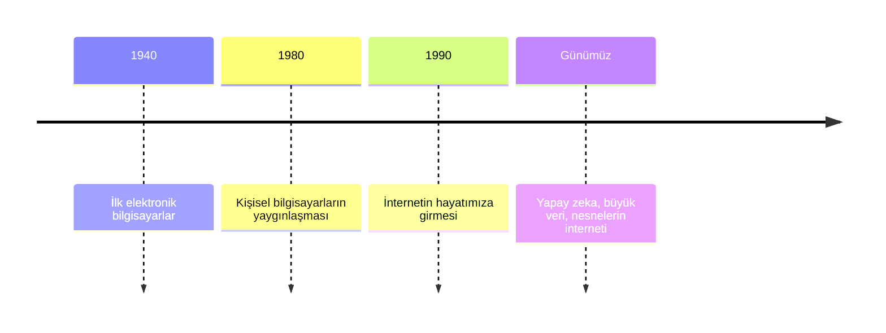
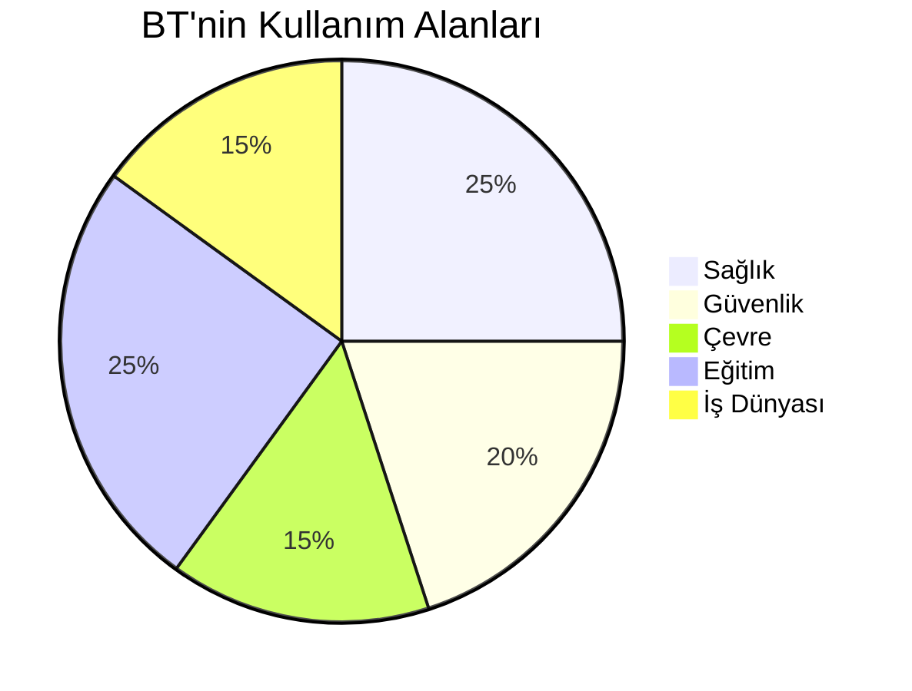
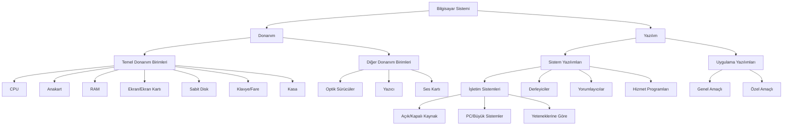
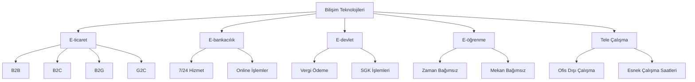
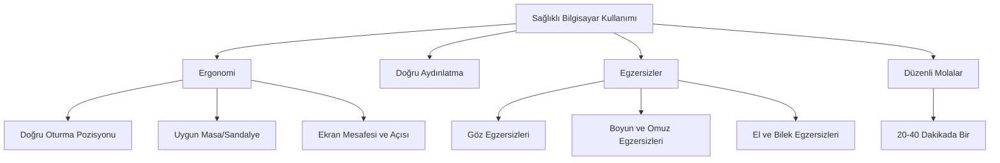
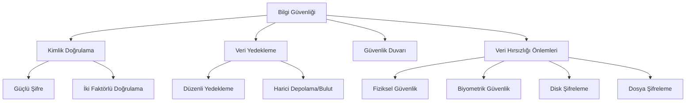
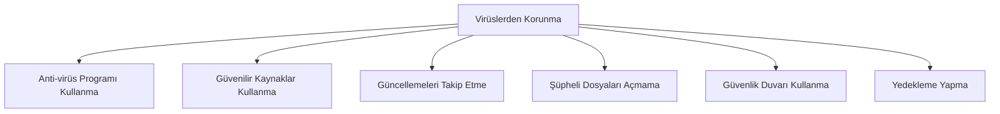
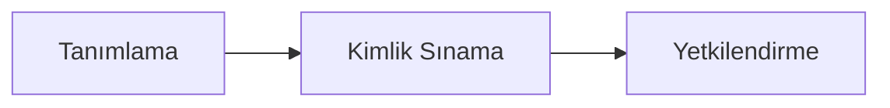

# 1. Hafta 1. Sunum

## 1. Giriş ve Temel Kavramlar

- **Bilgi Teknolojileri (BT) Tanımı:** Bilgilerin toplanması, işlenmesi, depolanması, iletilmesi ve yönetilmesi için kullanılan teknolojiler.
- **BT'nin Bileşenleri:** 
  - Bilgisayarlar
  - Yazılımlar
  - Ağlar
  - İnternet

## 2. BT'nin Tarihsel Gelişimi

## 3. BT'nin Günlük Yaşam Üzerindeki Etkileri

- Eğitim: Online dersler, dijital kitaplar
- Sağlık: Dijital hasta kayıtları, tele sağlık hizmetleri
- İş Dünyası: Otomasyon, veri analitiği, bulut bilişim
- Günlük Yaşam: Online alışveriş, bankacılık, sosyal medya

## 4. BT'nin Farklı Alanlarda Kullanımı

## 5. Bilgi Güvenliği ve Yasal Konular

- **Veri Koruma:** Şifreleme, yedekleme, güvenli veri iletimi
- **Kimlik Doğrulama ve Yetkilendirme**
- **Telif Hakları:** Dijital içeriklerin korunması
- **Yasal Sorumluluklar:** 
  - Lisanslama
  - Kişisel verilerin korunması
  - Siber suçlarla mücadele

# 1. Hafta 6 Sayfa Olan

## 1. Donanım (Hardware)

- **Tanım:** Bilgisayarı oluşturan veya bilgisayara takılabilen her türlü fiziksel parça
- **Temel Donanım Birimleri:**
  - Merkezi İşlem Birimi (CPU)
  - Anakart
  - Ana Bellek (RAM)
  - Ekran
  - Ekran Kartı
  - Sabit Disk
  - Klavye
  - Fare
  - Kasa
- **Diğer Donanım Birimleri:**
  - Optik Sürücüler
  - Yazıcı
  - Ses Kartı

## 2. Yazılım (Software)

- **Tanım:** Donanımları kullanmak ve bilgisayar sisteminde istenilen işlemleri yerine getirmek için hazırlanmış komutlar topluluğu
- **Türleri:**
  1. Sistem Yazılımları
  2. Uygulama Yazılımları

### 2.1 Sistem Yazılımları

- **Türleri:**
  - İşletim Sistemleri
  - Derleyiciler (Compiler)
  - Yorumlayıcılar (Interpreter)
  - Hizmet (Utility) Programları

#### 2.1.1 İşletim Sistemleri

- **Tanım:** Bilgisayar sistemini yöneten ve donanımları çalıştıran yazılımlar
- **Temel İşlevleri:**
  - İşlem Yönetimi
  - Dosya Yönetimi
  - Bellek Yönetimi
  - Giriş-Çıkış Birimleri Yönetimi
  - Grafik Arayüz Kontrolü

- **İşletim Sistemi Türleri:**
  1. Açık / Kapalı kaynak kodlu
     - Açık Kaynak: Linux tabanlı sistemler (Ubuntu, Fedora, Pardus)
     - Kapalı Kaynak: Windows, MacOS, Sun-Solaris
  2. Kişisel bilgisayar / Büyük sistemler için
  3. Yeteneklerine göre:
     - Gerçek zamanlı
     - Çok / tek kullanıcılı
     - Çoklu / tekli görevli
     - Dağıtılmış

- **Tarihsel Gelişim:**
  - İlk Kuşak: Kablo değiştirme ile programlama
  - İkinci Kuşak: Delikli kart kullanımı (IBSYS)
  - Üçüncü Kuşak: Çoklu görev yeteneği
  - Dördüncü Kuşak: Modern işletim sistemleri

### 2.2 Uygulama Yazılımları

- **Tanım:** Kullanıcıların çeşitli işlemleri yapabilmeleri için tasarlanan yazılımlar
- **Türleri:**
  1. Genel Amaçlı (Örn: Ofis programları)
  2. Özel Amaçlı (Örn: Fabrika üretim yönetimi yazılımı)

## 3. Bilgisayar Sistemi Şeması

# 1. Hafta 24 Sayfa Olan

## 1. Bilişim Teknolojileri

- Bilişim teknolojisi, bilginin üretimi, işlenmesi, depolanması ve dağıtımı için kullanılan teknolojileri kapsar.
- Bilgi toplumuna geçiş, teknolojinin hızlı gelişimi ile gerçekleşmiştir.
- E-ticaret: İnternet üzerinden mal ve hizmet alım-satımı (B2B, B2C, B2G, G2C)
- E-bankacılık: İnternet üzerinden bankacılık işlemleri, 7/24 hizmet
- E-devlet: Kamu hizmetlerinin elektronik ortamda sunulması (vergi ödeme, SGK işlemleri vb.)
- E-öğrenme: İnternet üzerinden eğitim, zaman ve mekandan bağımsız öğrenme imkanı
- Tele Çalışma: Uzaktan çalışma, ofis dışında iş yapabilme imkanı

## 2. İletişim

- Elektronik posta (e-posta): En yaygın kullanılan iletişim aracı, hızlı ve ekonomik
- Anlık mesajlaşma: Gerçek zamanlı iletişim (örn. WhatsApp, Telegram)
- VoIP (Voice over IP): İnternet üzerinden sesli iletişim (örn. Skype)
- RSS (Really Simple Syndication): İçerik dağıtımı ve takibi için kullanılan format
- Blog: Kişisel veya kurumsal web günlükleri
- Podcast: Sesli veya görüntülü içerik dağıtımı

## 3. Sanal İletişimler

- Sanal topluluklar: Ortak ilgi alanlarına sahip insanların buluşma noktaları
- Sosyal ağ siteleri: Facebook, Twitter, LinkedIn gibi platformlar
- İçerik yayınlama yolları: Kişisel web siteleri, bloglar, video platformları
- Çevrimiçi bağlantılarda güvenlik: Kişisel bilgilerin korunması, güvenli şifre kullanımı

## 4. Sağlık

- Ergonomi: İş ortamının insan sağlığına uygun hale getirilmesi
  - Doğru oturma pozisyonu
  - Uygun masa ve sandalye yüksekliği
  - Ekran mesafesi ve açısı
- Aydınlatma: Göz sağlığı için uygun ışık koşulları
- Bilgisayar kullanırken yapılacak egzersizler:
  - Göz egzersizleri
  - Boyun ve omuz egzersizleri
  - El ve bilek egzersizleri
- Düzenli molalar: Her 20-40 dakikada bir kısa mola

## 5. Çevre

- Geri dönüşüm:
  - Elektronik atıkların (e-atık) geri dönüşümü
  - Yazıcı kartuşlarının yeniden doldurulması
- Enerji tasarrufu:
  - Bilgisayarların enerji tasarruf modunda kullanımı
  - Energy Star sertifikalı cihazların tercih edilmesi
- Elektronik belge kullanımı: Kağıt tüketiminin azaltılması

## 6. Güvenlik

- Kimlik doğrulama:
  - Güçlü şifre oluşturma ve kullanma
  - İki faktörlü kimlik doğrulama
- Veri yedekleme:
  - Düzenli yedekleme planı
  - Harici depolama cihazları veya bulut hizmetleri kullanımı
- Güvenlik duvarı (firewall): Ağ trafiğini kontrol eden yazılım veya donanım
- Veri hırsızlığına karşı önlemler:
  - Fiziksel güvenlik (Kensington kilidi vb.)
  - Biyometrik güvenlik (Parmak izi, yüz tanıma)
  - Disk şifreleme
  - Dosya şifreleme

# SiberAy Sunumu

## 1. Dijital Okuryazarlık Nedir?
Dijital okuryazarlık, akıllı cihazları ve sistemleri anlama, dijital mecralarda bilgiyi kullanma, anlama ve oluşturma becerilerini ifade eder. Bu, modern dünyada etkin bir şekilde iletişim kurmak ve çalışmak için temel bir yetkinliktir.

## 2. Dijital Okuryazarlık Türleri
1. **Teknoloji Okuryazarlığı**: Genel teknoloji kullanımı ve anlayışı
2. **Bilgisayar Okuryazarlığı**: Bilgisayar sistemlerini ve yazılımlarını kullanma becerisi
3. **İletişim Okuryazarlığı**: Dijital platformlarda etkili iletişim kurma yeteneği
4. **Sosyal Medya Okuryazarlığı**: Sosyal medya platformlarını anlama ve etkin kullanma
5. **İnternet Okuryazarlığı**: İnterneti güvenli ve verimli kullanma becerisi

## 3. Dijital Okuryazarlığın 3 Ana İlkesi
1. **Kullanmak**: 
   - Bilgisayar programlarını kullanma
   - Arama motorları gibi bilgi kaynaklarına erişim
   - Gelişmiş ve etkili dijital yetenekler geliştirme
2. **Anlamak**: 
   - Dijital medyayı anlama
   - Eleştirel değerlendirme yapabilme
   - Medya içeriğini doğru yorumlama
3. **Oluşturmak**: 
   - Çeşitli dijital medya araçları ile içerik üretme
   - Etkili bir şekilde iletişim kurma
   - Yaratıcı dijital projeler geliştirme

## 4. Neden Dijital Okuryazarlık Önemli?
- Bilgiye hızlı ve doğru ulaşma
- Medyayı aktif ve yenilikçi kullanım
- Eleştirel düşünme ve muhakeme yapma yeteneği geliştirme
- Kişisel verilerin önemini anlama ve koruma
- Ahlaki ve etik değerlere uygun davranma
- İletişim ve iş birliği becerilerini geliştirme
- Problem çözme yeteneğini artırma
- Yaratıcılık ve yenilik fırsatlarını keşfetme
- Etkili araştırma yapabilme

## 5. Dijital Okuryazarlığın Temel Kavramları
1. **Dijital ortam ağa bağlıdır**: 
   - Tek yönlü bağlantı yoktur
   - Herkes içerik yayınlayabilir ve izleyici bulabilir
2. **Dijital medya kalıcı, aranabilir ve paylaşılabilirdir**: 
   - İçerikler depolanabilir ve kolayca bulunabilir
   - Paylaşılan içerikler uzun süre erişilebilir kalabilir
3. **Dijital medyanın bilinmeyen izleyicileri vardır**: 
   - Paylaşımlar beklenmedik kişiler tarafından görüntülenebilir
   - Gizlilik ayarları önemlidir
4. **Dijital medya deneyimleri gerçektir ancak her zaman gerçek hissettirmez**: 
   - Çevrimiçi olaylara gerçek hayattaki gibi tepkiler verilebilir
   - Sanal ve gerçek arasındaki çizgi bulanıklaşabilir
5. **Dijital medya mimarisi kullanıcı hareketlerini etkiler**: 
   - Platformların tasarımı kullanıcı davranışlarını şekillendirir
   - İçeriğin sunuluş biçimi, algılanma şeklini etkiler

## 6. Önemli Kavramlar
### 6.1 Dijital Vatandaş
- İnterneti doğru, etkin ve etik kullanma becerisi
- Dijital ortamda sorumlu davranış sergileme

### 6.2 Dijital Ayak İzi
- İnternet kullanımı sırasında bırakılan izler
- Sosyal medya kullanımı, ziyaret edilen siteler, alışverişler vb.

### 6.3 Bilişim Etiği
- Bilişim teknolojileri kullanıcılarının uyması gereken kurallar
- Amacı: Dijital ortamı daha güvenli hale getirmek ve riskleri azaltmak

### 6.4 Kişisel Veri
- Kişiyi doğrudan ya da dolaylı olarak belirlenebilir kılan tüm bilgiler
- Örnekler: Telefon numarası, e-posta adresi, fotoğraf, ses kayıtları, sağlık bilgileri

### 6.5 Bilgi Kirliliği
- Yanlış, yalan ya da asılsız bilgilerin yayılması
- Doğru bilgilerin yanında veya dışında oluşan yanıltıcı içerikler

## 7. 2022 Yılı Türkiye İstatistikleri
- İnternete erişim imkanı olan hane oranı: %94,1
- İnternet kullanan bireylerin oranı: %85,0
- İnternet üzerinden alışveriş yapma oranı: %46,2
- En çok satın alınan ürün kategorisi: Giyim, ayakkabı ve aksesuar (%71,3)
- En çok satın alınan dijital içerik: Film veya dizi izleme hizmeti (%26,4)

## 8. Güvenli Dijital Okuryazarlık İpuçları
1. Güçlü ve benzersiz parolalar kullanın
2. İki faktörlü kimlik doğrulaması etkinleştirin
3. Gizlilik ayarlarınızı düzenli olarak gözden geçirin ve yapılandırın
4. Konumunuzu gereksiz yere paylaşmaktan kaçının
5. Güncel bir anti-virüs programı ve güvenlik duvarı kullanın
6. Sadece güvenli ve şifreli (HTTPS) web sayfalarını ziyaret edin
7. Açık kablosuz ağları mecbur kalmadıkça kullanmayın
8. Önemli verilerinizi düzenli olarak yedekleyin
9. İşletim sistemi ve uygulama güncellemelerini ihmal etmeyin
10. Sosyal mühendislik saldırılarına karşı dikkatli olun

## 9. Çevrimiçi Alışveriş Güvenliği
- Alışveriş yapmadan önce kullanıcı yorumlarını okuyun
- Satıcı veya site hakkında detaylı araştırma yapın
- Ortak kullanılan bilgisayarlardan alışveriş yapmaktan kaçının
- Kart bilgilerinizi sitelerde kaydetmeyin
- Bağlantı ve site adresinin doğruluğunu her zaman teyit edin
- Mümkünse sanal kart veya tek kullanımlık kartlar tercih edin
- Alışveriş yaparken güvenli ödeme yöntemlerini kullanın

## 10. Teknoloji Kullanımıyla Birlikte Ortaya Çıkan Riskler
- Yanlış dil kullanımı ve iletişim sorunları
- Bilgi kirliliği ve yanlış bilginin hızla yayılması
- Siber zorbalık ve taciz
- Spam ve istenmeyen içerikler
- Siber suçlar (dolandırıcılık, hırsızlık vb.)
- Kişisel veri kaybı ve mahremiyetin ihlali
- Kimlik hırsızlığı
- Sahte profiller ve sosyal mühendislik saldırıları

## 11. Mağduriyet Durumunda Yapılabilecekler
1. Siber zorbayı veya rahatsız edici içeriği hemen engelleyin
2. Karşılık vermeyin veya misilleme yapmayın
3. Platformun şikayet mekanizmalarını kullanarak durumu bildirin
4. Mağduriyetinize ait tüm delilleri (ekran görüntüleri, mesajlar vb.) saklayın
5. 18 yaş üstü iseniz şahsen, altı iseniz ebeveynlerinizle birlikte yetkili makamlara başvurun:
   - Cumhuriyet savcılığı
   - Polis
   - Jandarma
6. Acil durumlarda 112 ihbar hattını arayın
7. Çevrimiçi ihbar için https://onlineislemler.egm.gov.tr/ adresini kullanın

# Virüsler, Telif Yasası

## 1. Virüsler

### 1.1 Bilgisayar Virüsü

Bilgisayar virüsleri, bilgisayarın çalışmasını engelleyen, verileri bozan veya silen, kendilerini internet üzerinden yayan zararlı yazılım programlarıdır. Virüsler:

- Bilgisayar programlarına istem dışı eklenir
- Programların asıl fonksiyonlarını engeller veya değiştirir
- Muzip virüslerden ciddi zarar vericilere kadar çeşitlilik gösterir

### 1.2 Virüsün Bilgisayara Girme Yolları

Virüsler genellikle şu yollarla bilgisayara girerler:

1. Temiz olmayan disketler, taşınabilir disk ve bellekler
2. CD ve DVD'ler
3. Ağ paylaşımı açık virüslü bilgisayarlar
4. E-postalar ve ekli dosyaları
5. Çeşitli karşılıklı görüşme programları
6. Sosyal ağlardaki paylaşımlar
7. Güvenilir olmayan web sayfaları

### 1.3 Virüslerden Korunma Yöntemleri

## 2. Telif Hakkı

### 2.1 Telif Hakkı Nedir?

Telif hakkı, bir bilgisayar yazılımının hak sahibinin izni olmadan kopyalanması, lisanssız kullanılması veya izin verilenden fazla çoğaltılması gibi eylemleri engelleyen yasal bir haktır.

### 2.2 Lisanslı Yazılım Nasıl Anlaşılır?

- Proof of License (Lisans Kanıtı) etiketi
- Yazılım Lisansı
- Ürün Kimliği Sınanması (PID)
- Son Kullanıcı Anlaşması (EULA)

### 2.3 Ücretsiz Yazılım Türleri

1. Public Domain Yazılımlar
2. Serbest (Freeware) Yazılımlar
3. Paylaşımlı (Shareware) Yazılımlar
4. Açık Kaynak (Open-source) Yazılımlar

## 3. Veri Koruma

### 3.1 Veri Koruma Nedir?

Veri koruma, bilişim güvenliğinde kaynaklara erişimi kontrol etmek ve verileri yetkisiz değişiklik ve açığa çıkarmadan korumak için yapılan faaliyetlerdir.

### 3.2 Erişim Denetimi Aşamaları

### 3.3 Ülkemizde Veri Koruma

Türkiye'de veri koruma için çeşitli yasa ve anlaşmalar mevcuttur:

- Yeni Türk Ceza Kanunu
- Fikir ve Sanat Eserleri Kanunu
- Elektronik İmza Kanunu
- Kişisel Verilerin Korunması Kanunu Tasarısı
- İnternet Ortamında Yapılan Yayınların Düzenlenmesine Dair Usul ve Esaslar Hakkında Yönetmelik

### 3.4 Ülkemizde Veri Koruma Sorumluluğu

Veri koruma sorumluluğu çeşitli kurumlar tarafından paylaşılmaktadır:

- Emniyet Genel Müdürlüğü bünyesindeki birimler
- Ulaştırma Bakanlığı bünyesindeki İnternet Kurulu
- Üniversitelerin ilgili enstitü ve çalışma grupları
- Sivil toplum kuruluşları
- Jandarma Genel Komutanlığı bünyesindeki birimler

Bu kurumlar, bilişim suçlarıyla mücadele, internet güvenliği, eğitim ve toplumu bilgilendirme konularında çalışmalar yürütmektedir.
